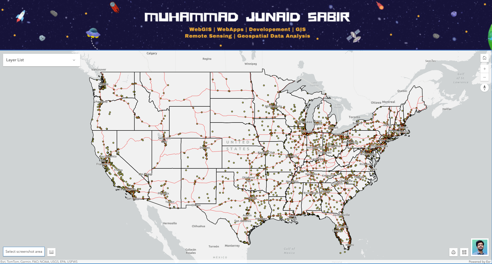
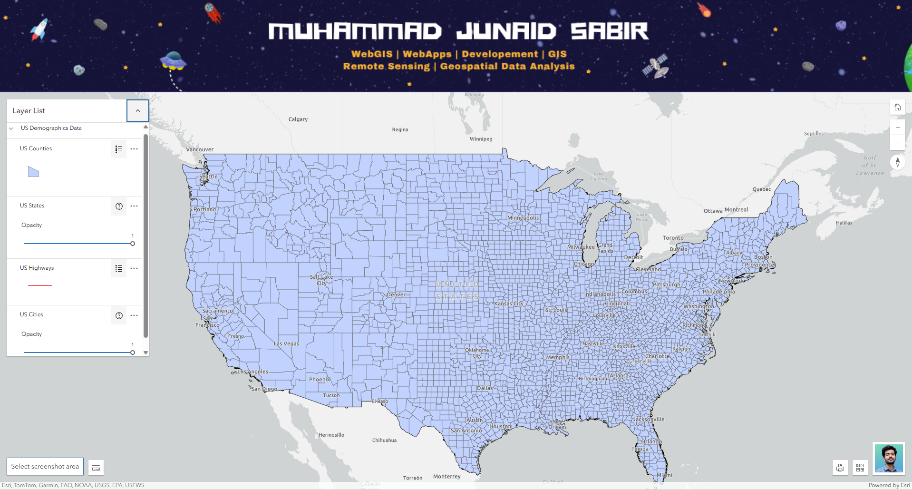
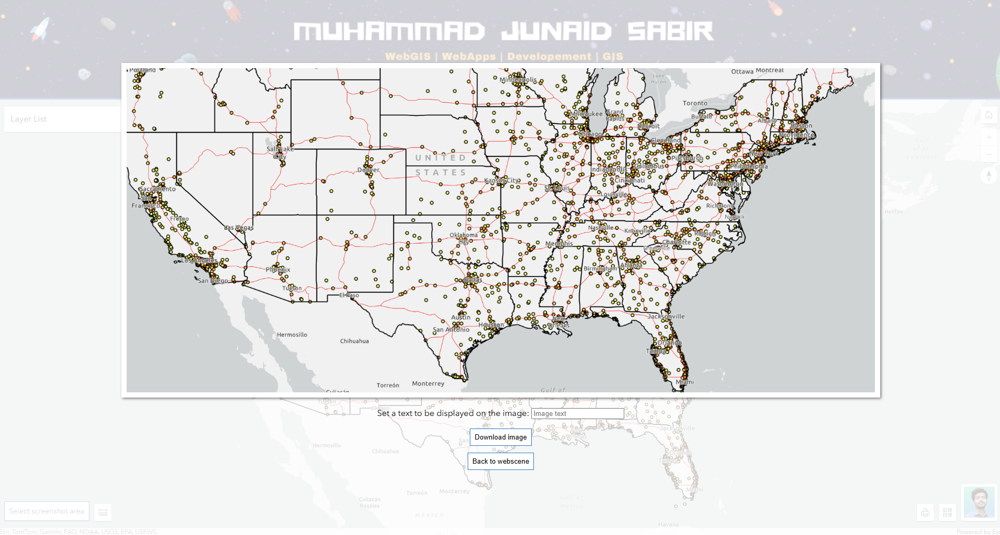
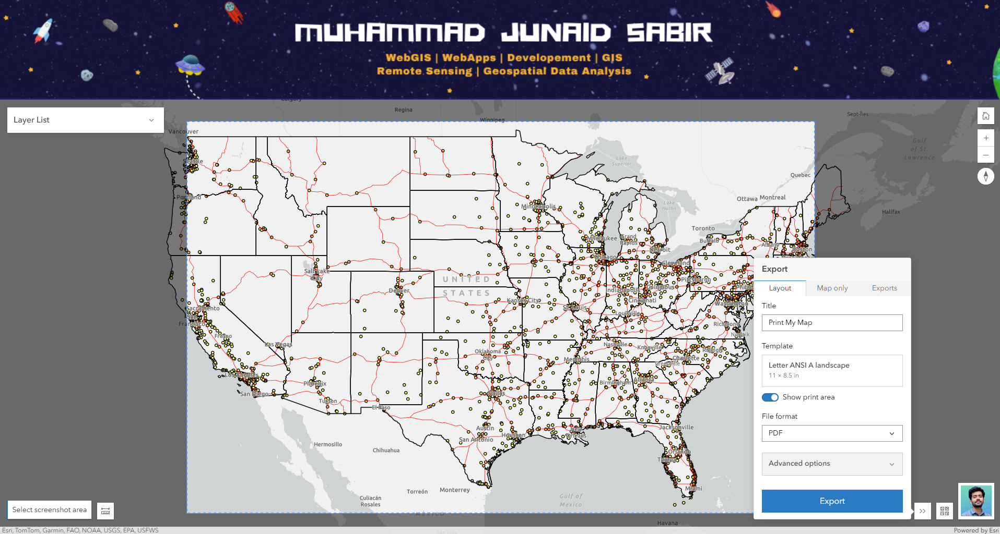

# Web GIS Application

PROJECT: "Demonstration of the Capabilities of ArcGIS API: ArcGIS Maps SDK for JavaScript 4.33"

This is a GIS Web app that contains sample data of the United States. This is a sample service hosted by ESRI, powered by ArcGIS Server. ESRI reserves the right to change or remove this service at any time and without notice.

_This WebGIS allows users to take Screenshot or Print the Map. It is designed to showcase Advance WebGIS functionalities of ArcGIS API in a user-friendly interface._

## Live Demo

[Link to show this App Demo](https://m-junad-sabir.github.io/Print-and-Screenshot-Widgets-ArcGIS-API/)

## Features

*   **Interactive Map:** Users can pan, zoom, and interact with the map.
*   **Home Mapview:** User can go back to the default Mapview of the webapp using Home Button.

### Initial Map View

*   **Layer Controls:** Highly Custumized Layerlist Panel containing Change Opacity and Toggle Legends (On and Off) functions.

### Legends and Opacity Toggle

*   **ScreenShot Feature** User can quickly take screenshot of its required area of interest in a decent manner and it will be downloaded in his PC.

### Screenshot Preview

*   **Esri Print Widget** User can use Print Widget to print the map view in a decent manner and it will be exported first using arcgis printing service and then can be saved in his PC.

### Print Widget Preview

## Key Features

*   **Interactive Map:** Built with the ArcGIS API for JavaScript, allowing for smooth panning, zooming, and exploration of spatial data.
*   **Dynamic Layer Control:** A layer list widget allows users to toggle the visibility of different map layers and groups of layers.
*   **Data-driven Popups:** Clicking on map features opens informative pop-ups with details about the selected feature.
*   **Informative Legends:** A legend widget helps users understand the symbols used on the map.
*   **Basemap Switching:** Users can switch between different basemaps (e.g., satellite, street) to suit their needs.
*   **Screenshot Widget:** User can take a Screenshot in HD.
*   **Print Widget:** User can take Print of the map and can export it in multiple Layout Styles or in Map only Style. The Layout exported print version will include basic map elements such as north arrow, legneds, scale bar, etc
*   **Responsive Design:** The application is designed to work on different screen sizes, from desktops to mobile devices.

## Built With

*   [ArcGIS API for JavaScript](https://developers.arcgis.com/javascript/latest/) - For creating interactive maps and GIS functionality.
*   HTML
*   CSS
*   JavaScript

## Setup and Installation

1.  Clone the repository
2.  Add your Own Published GIS Layers from ArcGIS Server
3.  Change Header Image and LogoDiv Image
4.  Open `index` file in your web browser

## License

This project is licensed under the [MIT License](./LICENSE).
